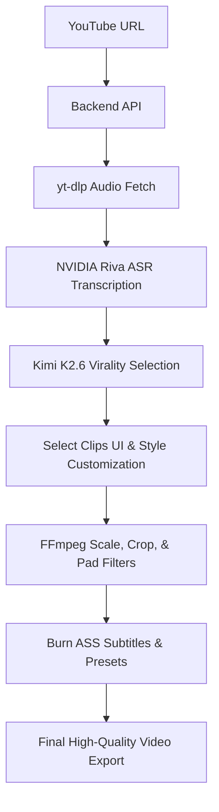

# 🎬 ClipForge

ClipForge is an AI-powered content recycling pipeline that automatically transcribes landscape videos, selects high-engagement clips, crops/pads them into multiple aspect ratios (9:16 vertical, 1:1 square, 4:5 Instagram feed), and burns in customized, animated word-level highlighted captions.

---

## ✨ Features

* **🎙️ NVIDIA Riva ASR Transcription**: Ultra-fast, millisecond-aligned speech-to-text conversion.
* **🧠 Kimi K2.6 Nim Clip Selection**: Automatic virality assessment of transcripts to select hooks and engagement segments.
* **📐 Crop & Pad Scaling Layouts**: Crop or pad videos dynamically between Shorts (9:16), Square (1:1), Feed (4:5), and Landscape (16:9) formats.
* **🔍 Real-Time Scale & Position Adjustments**: Adjust zoom scale (0.5x to 2.0x) and pan video horizontally/vertically (X/Y offsets) to center speakers.
* **🎨 Rich Subtitle Styles**: Customize outlines, shadow offsets, font sizes, margins, alignment, letter spacing, line height, and capitalization.
* **✏️ Word-Level Customizations**: Override styles (color, font, size, spacing, outline, superscript/subscript, bold, italic) on individual words in the editor.
* **🎥 Cinematic Vibe Presets**: Apply Noir B&W, Warm Vintage, Cool Tone, Cyber Neon color grading, and organic film grain effects.
* **⚡ WYSIWYG Live Preview Mockup**: A high-fidelity frontend player mockup showing pixel-perfect subtitle rendering and video framing before rendering.

---

## 🛠️ Tech Stack

* **Frontend**: React, Vite, CSS Grid & Flexbox, HTML5 Subtitle Mockup Renderer
* **Backend**: FastAPI, Pydantic, Python 3
* **Video/Audio Pipeline**: FFmpeg, yt-dlp, ASS (Advanced Substation Alpha) subtitle generator

---

## 🏗️ Architecture



---

## 🚀 Getting Started

### Prerequisites

* Python 3.9+
* Node.js 18+
* FFmpeg (installed and added to PATH)

---

### Backend Setup

1. Navigate to the backend directory:
   ```bash
   cd backend
   ```
2. Create and activate a virtual environment:
   ```bash
   python3 -m venv venv
   source venv/bin/activate
   ```
3. Install dependencies:
   ```bash
   pip install -r requirements.txt
   ```
4. Create a `.env` file in the `backend/` directory:
   ```env
   PORT=8000
   FFMPEG_PATH=/path/to/your/ffmpeg
   ```
5. Run the FastAPI development server:
   ```bash
   python3 -m uvicorn main:app --reload --port 8000
   ```

---

### Frontend Setup

1. Navigate to the frontend directory:
   ```bash
   cd frontend
   ```
2. Install package dependencies:
   ```bash
   npm install
   ```
3. Start the Vite development server:
   ```bash
   npm run dev
   ```
4. Open your browser and navigate to `http://localhost:5173`.

---

## 📄 License

This project is licensed under the MIT License.